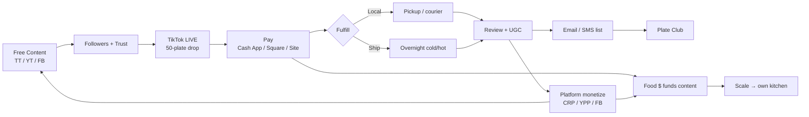

# GET THE BAG — Fifi's Soul Food Plate Playbook

**Brand:** Fifi's Soul Food Plate  
**Operators:** Mom (Fifi) + Traplord Vee (traplandlord)  
**Goal:** One system — content → live → pay → fulfill → review → monetize → kitchen  
**Date:** Sep 22, 2026 (PT)  
**Companion files:** `live-sales-funnel.csv` · `fifi-comprehensive-metrics.csv` · `business-plan.md` §13

---

## How this fits together (one diagram)



**ASCII (print-friendly):**

```
  CONTENT (free cook/haul/ASMR)
       │
       ▼
  FOLLOWERS ──► TIKTOK LIVE (50 plates, scarcity)
       │              │
       │              ▼
       │         PAY (before cook / before ship)
       │              │
       │              ▼
       │         FULFILL ──► pickup | local deliv | overnight
       │              │
       ▼              ▼
  PLATFORM $ ◄── REVIEW / UGC / LIST
  (YT · TT · FB)         │
       │                 ▼
       └────► PLATE CLUB → OWN KITCHEN
```

**Flywheel in one line:** Food sales fund the content; content funds the food sales; lists + Plate Club lock the bag.

---

## A) TikTok LIVE for sales talk

### How to run a live (6 beats)

1. **Hook (0:00–0:45)** — “Tonight only — 50 Soul Food Pop plates. Fried chicken, greens, sweets, roll. $20 pickup. Overnight ships too.”
2. **Plate reveal** — Show steam, crunch, portion size. Name every item on the plate.
3. **Scarcity** — “Only 50. Counter on screen / shout remaining every 5 sales.”
4. **Price + stack** — Pickup $20 · overnight cold/hot add-on · DoorDash premium separate.
5. **CTA** — “Link in bio → site checkout” **or** “Cash App $____ with name in note” · pin comment with URL.
6. **Close** — Last 5 plates, countdown, thank buyers, remind overnight cutoff.

### Sample talk-track bullets (not a novel)

- “Mom cooked this for Soul Food Pop — same plate every time so it tastes like home.”
- “If you’re local: pickup tonight. If you’re not: overnight cold or hot — order by **10 AM PT Mon–Thu** for next-day.”
- “Cash App / Venmo / site — pay **before we cook your batch** so we don’t overcook.”
- “Plate Club coming — half-off dinners for members. Drop your email in the site.”
- “Duet this if you got yours — we repost UGC.”

### Conversion assumptions (viewers → click → pay)

| Stage | Low | Mid | High | Notes |
|-------|-----|-----|------|-------|
| Viewers → click/link | 2% | 5% | 10% | Pin + verbal CTA every 3–5 min |
| Click → start checkout | 20% | 40% | 60% | Friction = too many steps |
| Checkout → paid | 30% | 50% | 70% | Pay-before-cook lifts close |
| **Viewers → paid (combined)** | **~0.1%** | **~1.0%** | **~4.2%** | Mid ≈ 1 paid / 100 viewers |
| **Rev / 100 viewers (mid)** | — | **~$20** | — | 1 × $20 plate; higher if ship add-ons |

See `live-sales-funnel.csv` for stage-by-stage rows.

### Live frequency & best windows (PT)

| Cadence | When | Why |
|---------|------|-----|
| **2–3× / week** Phase 1 | Tue / Thu / Sat | Matches cook batches + 50-plate sellouts |
| Best live windows | **6:30–8:30 PM PT** dinner hunger | Primary |
| Secondary | **11:30 AM–1:00 PM PT** lunch scroll | Secondary |
| Overnight push | Morning lives **8–10 AM PT** Mon–Thu | Drive cutoff orders |

**Confidence:** mid estimates — measure your first 10 lives and update CSV.

---

## B) Payment structure possibilities

### Options + approx fees (US, Sep 2026)

| Method | Approx fee | When to use | Confidence |
|--------|------------|-------------|------------|
| **Cash (pickup)** | 0% | Best net $ | high |
| **Zelle** | 0% typical (bank) | Known locals; confirm name | med |
| **Venmo Business** | ~1.9% + $0.10 | Peer app crowd | med — [Venmo Help](https://help.venmo.com/cs/articles/business-profile-transaction-fees-vhel221) |
| **Cash App Business** | ~2.6% + $0.15 | LIVE pin / bio | med — [Cash App](https://cash.app/help/us/en-us/6521-cash-for-business-fees) |
| **Square in-person** | ~2.6% + $0.15 | Markets / car | high — [Square](https://squareup.com/help/us/en/article/5068-what-are-square-s-fees) |
| **Square online / links** | ~3.3% + $0.30 | Site Phase 2 | high |
| **Stripe online** | ~2.9% + $0.30 | Custom site later | high |
| **Apple Pay** | via Square/Stripe | Same as processor | high |
| **Site mailto / SMS order** | 0% until pay | Phase 1 workflow | high |
| **DoorDash / GH prepaid** | ~15–30% marketplace | Discovery; use **premium menu $26** | med |
| **Deposit for overnight** | same as method | 100% prepaid before pack | high |
| **COD local** | 0% + risk | **Avoid** unless trusted repeat | low — not recommended Phase 1 |

### Recommended stack

| Phase | Stack | Why |
|-------|-------|-----|
| **Phase 1** | Cash + Cash App Business + Venmo Business + Square reader (markets) + SMS/email order confirm | Fast, Mom-friendly, low setup |
| **Phase 2** | Add Square Payment Links or Stripe + Apple Pay on site; keep Cash App for LIVE | Fewer missed payments; tracking |
| **Never Phase 1** | COD for overnight; matching DD at $20 | Margin death / no-shows |

### When to take payment

| Fulfillment | Take money | Reason |
|-------------|------------|--------|
| Pickup / pop | **Before cook** (or at handoff if cash + known) | Protect 50-plate batch |
| Local courier | **Before dispatch** | No drive-for-free |
| Overnight | **100% before pack / carrier pickup** | Shipper + food risk |
| DoorDash | Platform prepaid | Already paid; cook to ticket |

---

## C) Profit + conversion → monetization

### Path

```
Free content → Followers → LIVE sales → Email/SMS list → Plate Club → Kitchen
```

### Platform thresholds (approx — research Sep 22, 2026)

| Platform | Program | Threshold (approx) | Notes | Confidence |
|----------|---------|-------------------|-------|------------|
| **TikTok** | Creator Rewards (ex-Creativity) | **10k followers** + **100k views / 30 days**; videos **>1 min** original | US eligible; not Duets/Stitches | med — [TikTok Creator Academy](https://www.tiktok.com/creator-academy/en/article/creator-rewards-program) |
| **TikTok** | LIVE + gifts | ~**1k followers** to go LIVE (region) | Gifts separate from CRP | med |
| **YouTube** | YPP full ads | **1k subs** + **4k watch hrs / 12 mo** *or* **10M Shorts / 90d** | Early fan-funding tier ~500 subs / 3k hrs | high — [YouTube Help](https://support.google.com/youtube/answer/72851) |
| **YouTube** | Note | Feb 1, **2027** new applicants may need **8k hrs / 20M Shorts** | Race to 4k before then | med — press 2026 |
| **Facebook** | Content Monetization | Invitation-only; old Reels Play / in-stream ended **Aug 31, 2025** | Some guides cite ~10k followers + watch-time bars; treat as **invite / estimate** | low–med — [Meta Help](https://www.facebook.com/business/help/1049081556813520) |

### Backend exposure (content that sells plates)

- YouTube long-form: cook day, grocery haul, packing ASMR, “50 plates in one night”
- FB: local groups, event posts, Reels cross-post (no watermark when possible)
- Cross-post Shorts ← TikTok cuts; always CTA to site / LIVE

### Flywheel money logic

| Direction | Mechanism |
|-----------|-----------|
| Food → content | Plate COGS ~$3.70; contrib ~$16.30 local funds ads, props, ship samples |
| Content → food | LIVE + organic → $20 dinners + ship add-ons |
| Both → kitchen | Surplus + Plate Club MRR → deposit on licensed kitchen |

---

## D) Overnight order times (with / without tracking)

### Customer-facing copy (use on site)

> **Order by 10:00 AM PT, Monday–Thursday** for next-day overnight.  
> **Tracking included** on paid overnight (cold $28 / hot $35).  
> **No-tracking local courier** option for nearby ZIPs (ask at checkout / text).  
> Friday–Sunday overnight: message us — may roll to Monday pickup window.

### Ops cutoffs

| Step | Time (PT) | Notes |
|------|-----------|-------|
| Customer order-by | **10:00 AM** Mon–Thu | `config.js` → `orderByLocalTime` |
| Cook / pack complete | By **12:00–1:00 PM** | Depends on batch |
| Carrier pickup | By **~2:00–3:00 PM** | `carrierPickupTime` — verify your UPS/USPS/FedEx window |
| Tracking upload | Same day as pickup | Paid overnight only |
| Local no-tracking courier | Same-day / next AM | Optional; lower price, higher trust needed |

### Risk metrics (planning)

| Metric | Mid assumption |
|--------|----------------|
| On-time pack vs cutoff | 90–95% target |
| Refund / remake if miss cutoff | High — offer pickup credit or re-ship; budget **3–8%** of overnight GMV until process is tight |
| Never ship without payment | Policy |

---

## E) Creative — maximize everything

Ranked by **effort vs net $** (Phase 1 focus at top):

| Rank | Play | Effort | Net $ potential | Notes |
|------|------|--------|-----------------|-------|
| 1 | **50-plate LIVE sellout** | Med | Highest / hour | Core bag |
| 2 | **Pay-before-cook Cash App** | Low | High | Cuts no-shows |
| 3 | **Overnight add-on on LIVE** | Med | High $/order | Cold/hot upsell |
| 4 | **DD premium $26 + cake/twist** | Med | Protects margin | Never match $20 |
| 5 | **Referral $5 off both** | Low | Med compound | After 20+ customers |
| 6 | **Live-only SKU** (extra wing / twist) | Low | Med | Scarcity |
| 7 | **Bundles** (2 plates / family) | Med | Med–high | Ship-friendly |
| 8 | **Pre-order calendar** | Med | Med | Smooths cook days |
| 9 | **Ship vs pickup by ZIP** | Med | Med | Less wrong fulfillment |
| 10 | **UGC repost + duet/stitch** | Low | Med reach | Fuel algorithm |
| 11 | **Countdown stickers** | Low | Low–med | Stories / LIVE |
| 12 | **Plate Club** | High setup | High LTV | Phase 2 |
| 13 | **Platform CRP / YPP** | High content | Variable | Parallel track |

---

## F) Mom + Traplord roles (keep it human)

| Who | Owns |
|-----|------|
| **Mom / Fifi** | Cook quality, plate look, LIVE taste talk, food safety temps |
| **Traplord Vee** | Timing, CTAs, payments log, cutoff enforcement, site/config, metrics CSV |
| **Both** | Thank-yous, UGC asks, “see you next drop” |

**Daily bag checklist**

1. Confirm plate count left vs 50  
2. Confirm payment before cook/ship  
3. Confirm overnight vs cutoff  
4. Post 1 content clip from today’s cook  
5. Log sold / refund / ship in simple sheet  

---

## Headline numbers (top 8)

1. **$1,000** — 50 × $20 sellout gross  
2. **~$16.30** — contrib per local $20 plate (after ~$3.70 COGS)  
3. **~1% mid** — LIVE viewers → paid  
4. **~$20 mid** — revenue per 100 LIVE viewers (plate only)  
5. **10 AM PT Mon–Thu** — overnight order-by (tracking on paid ship)  
6. **Phase 1 pay stack** — Cash + Cash App (~2.6%+$0.15) + Venmo Biz (~1.9%+$0.10) + Square  
7. **TikTok CRP** — ~10k followers + 100k views/30d (estimate, 2026)  
8. **YPP ads** — 1k subs + 4k watch hrs (or 10M Shorts/90d); raise possible Feb 2027  

---

*Not legal/tax/financial advice. Fees and platform thresholds change — re-check sources before relying on payouts. Update `fifi-comprehensive-metrics.csv` when you measure real conversion.*
